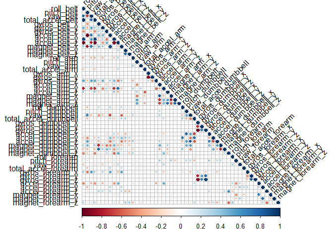
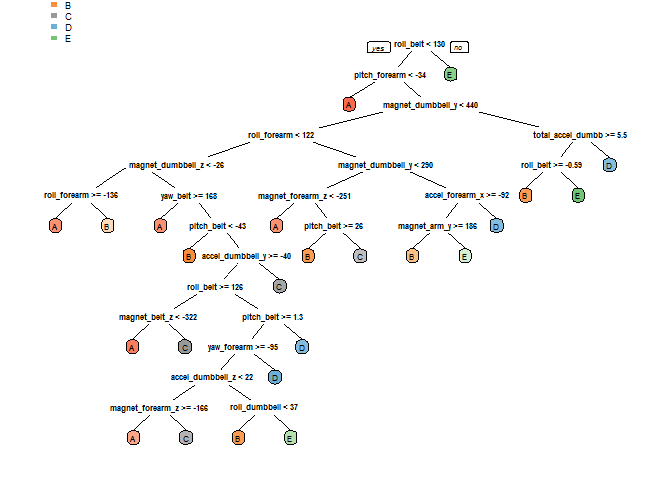

# Machine Learning Project
Dario Oviedo Rueda  
July 7, 2018  


```r
library(lattice)
library(ggplot2)
library(caret)
library(rpart)
library(rpart.plot)
library(randomForest)
```

```
## randomForest 4.6-14
```

```
## Type rfNews() to see new features/changes/bug fixes.
```

```
## 
## Attaching package: 'randomForest'
```

```
## The following object is masked from 'package:ggplot2':
## 
##     margin
```

```r
library(corrplot)
```

```
## corrplot 0.84 loaded
```

```r
library(randomForest)
library(RColorBrewer)
library(rattle)
```

```
## Rattle: A free graphical interface for data science with R.
## Version 5.1.0 Copyright (c) 2006-2017 Togaware Pty Ltd.
## Type 'rattle()' to shake, rattle, and roll your data.
```

```
## 
## Attaching package: 'rattle'
```

```
## The following object is masked from 'package:randomForest':
## 
##     importance
```

<br/>

## 1. Introduction
<br/>

### a) Background
Using devices such as Jawbone Up, Nike FuelBand, and Fitbit it is now possible to collect a large amount of data about personal activity relatively inexpensively. These type of devices are part of the quantified self movement - a group of enthusiasts who take measurements about themselves regularly to improve their health, to find patterns in their behavior, or because they are tech geeks. In this project, your goal will be to use data from accelerometers on the belt, forearm, arm, and dumbell of 6 participants. They were asked to perform barbell lifts correctly and incorrectly in 5 different ways. More information is available from the website here: http://groupware.les.inf.puc-rio.br/har (see the section on the Weight Lifting Exercise Dataset).
<br/>

### b) Data
The training data for this project are available here:
https://d396qusza40orc.cloudfront.net/predmachlearn/pml-training.csv

The test data are available here:
https://d396qusza40orc.cloudfront.net/predmachlearn/pml-testing.csv

The data for this project come from this source:
http://groupware.les.inf.puc-rio.br/har. 

If you use the document you create for this class for any purpose please cite them as they have been very generous in allowing their data to be used for this kind of assignment.
<br/>


## 2. Cleanning the environment

Even if it is not necesary, I am trying to implement this line in all my codes to have a clean environment


```r
rm(list = ls())
```

<br/>

## 3. Set the seed

Set the seed to get the same results


```r
set.seed(1980)
```

<br/>

## 4. Read the data

Read the data from the web. 


```r
Train_data_web <- "http://d396qusza40orc.cloudfront.net/predmachlearn/pml-training.csv"
Test_data_web <- "http://d396qusza40orc.cloudfront.net/predmachlearn/pml-testing.csv"

train_Crude <- read.csv(url(Train_data_web), na.strings = c("NA", "$DIV/0!",""))
test_Crude <- read.csv(url(Test_data_web), na.strings = c("NA", "$DIV/0!",""))
train_Data <- train_Crude
test_Data <- test_Crude
```

<br/>

## 5. Clean the data

We need to clean the data using different methods:

### a. Removing NA's

```r
train_Data <- train_Data[, colSums(is.na(train_Data)) == 0]
test_Data <- test_Data[, colSums(is.na(test_Data)) == 0]
```

### b. Removing garbash

```r
classe <- train_Data$classe
train_garb <- grepl("^X|timestamp|window", names(train_Data))
train_Data <- train_Data[, !train_garb]
train_Clean <- train_Data[, sapply(train_Data, is.numeric)]
train_Clean$classe <- classe
test_garb <- grepl("^X|timestamp|window", names(test_Data))
test_Data <- test_Data[, !test_garb]
testCleaned <- test_Data[, sapply(test_Data, is.numeric)]
```

<br/>

## 6. Making the partition
The next lines make the partition with 75% to training and using the cleaning data,make a new data framework


```r
inTrain <- createDataPartition(train_Clean$classe, p=0.75, list=F)
trainData <- train_Clean[inTrain, ]
testData <- train_Clean[-inTrain, ]
```

<br/>

## 7. Correlation analysis


```r
cor_plot <- cor(trainData[, -length(names(trainData))])
corrplot(cor_plot, type = "lower", tl.col = "black", tl.srt = 45)
```

<!-- -->

<br/>

## 8. Prediction with Deicision tree
These are the decision tree.


```r
treeModel <- rpart(classe ~ ., data=trainData, method="class")
prp(treeModel, box.palette = "auto", compress = TRUE, ycompress = TRUE)
```

<!-- -->

```r
predict_DT <- predict(treeModel, testData, type = "class")
DT_CM <- confusionMatrix(testData$classe, predict_DT)
DT_CM
```

```
## Confusion Matrix and Statistics
## 
##           Reference
## Prediction    A    B    C    D    E
##          A 1224   56   39   47   29
##          B  147  584   88   79   51
##          C   15   77  687   55   21
##          D   54   79  119  511   41
##          E   13   95  105   50  638
## 
## Overall Statistics
##                                           
##                Accuracy : 0.7431          
##                  95% CI : (0.7306, 0.7553)
##     No Information Rate : 0.2963          
##     P-Value [Acc > NIR] : < 2.2e-16       
##                                           
##                   Kappa : 0.6746          
##  Mcnemar's Test P-Value : < 2.2e-16       
## 
## Statistics by Class:
## 
##                      Class: A Class: B Class: C Class: D Class: E
## Sensitivity            0.8424   0.6554   0.6618   0.6887   0.8179
## Specificity            0.9504   0.9090   0.9565   0.9296   0.9362
## Pos Pred Value         0.8774   0.6154   0.8035   0.6356   0.7081
## Neg Pred Value         0.9347   0.9224   0.9133   0.9437   0.9645
## Prevalence             0.2963   0.1817   0.2117   0.1513   0.1591
## Detection Rate         0.2496   0.1191   0.1401   0.1042   0.1301
## Detection Prevalence   0.2845   0.1935   0.1743   0.1639   0.1837
## Balanced Accuracy      0.8964   0.7822   0.8092   0.8091   0.8771
```

```r
accuracy_DT <- postResample(predict_DT, testData$classe)
accuracy_DT
```

```
##  Accuracy     Kappa 
## 0.7430669 0.6746141
```

<br/>

## 9. Prediction with Random forest


```r
controlRf <- trainControl(method="cv", 5)
model_Rforest <- train(classe ~ ., data=trainData, method="rf", trControl=controlRf, ntree=250)
model_Rforest
```

```
## Random Forest 
## 
## 14718 samples
##    52 predictor
##     5 classes: 'A', 'B', 'C', 'D', 'E' 
## 
## No pre-processing
## Resampling: Cross-Validated (5 fold) 
## 
## Summary of sample sizes: 11775, 11774, 11776, 11773, 11774 
## 
## Resampling results across tuning parameters:
## 
##   mtry  Accuracy   Kappa      Accuracy SD  Kappa SD   
##    2    0.9919147  0.9897717  0.002394491  0.003029767
##   27    0.9911673  0.9888261  0.001247648  0.001578511
##   52    0.9840334  0.9797986  0.003657053  0.004628340
## 
## Accuracy was used to select the optimal model using  the largest value.
## The final value used for the model was mtry = 2.
```

```r
RFModel <- randomForest(classe ~ ., data=trainData)
predict_RF <- predict(RFModel, testData, type = "class")
RF_CM <- confusionMatrix(predict_RF, testData$classe)
RF_CM
```

```
## Confusion Matrix and Statistics
## 
##           Reference
## Prediction    A    B    C    D    E
##          A 1393    7    0    0    0
##          B    2  942    2    0    0
##          C    0    0  852   16    0
##          D    0    0    1  788    3
##          E    0    0    0    0  898
## 
## Overall Statistics
##                                          
##                Accuracy : 0.9937         
##                  95% CI : (0.991, 0.9957)
##     No Information Rate : 0.2845         
##     P-Value [Acc > NIR] : < 2.2e-16      
##                                          
##                   Kappa : 0.992          
##  Mcnemar's Test P-Value : NA             
## 
## Statistics by Class:
## 
##                      Class: A Class: B Class: C Class: D Class: E
## Sensitivity            0.9986   0.9926   0.9965   0.9801   0.9967
## Specificity            0.9980   0.9990   0.9960   0.9990   1.0000
## Pos Pred Value         0.9950   0.9958   0.9816   0.9949   1.0000
## Neg Pred Value         0.9994   0.9982   0.9993   0.9961   0.9993
## Prevalence             0.2845   0.1935   0.1743   0.1639   0.1837
## Detection Rate         0.2841   0.1921   0.1737   0.1607   0.1831
## Detection Prevalence   0.2855   0.1929   0.1770   0.1615   0.1831
## Balanced Accuracy      0.9983   0.9958   0.9963   0.9896   0.9983
```

```r
accuracy_RF <- postResample(predict_RF, testData$classe)
accuracy_RF
```

```
##  Accuracy     Kappa 
## 0.9936786 0.9920031
```

<br/>

## 10. Results

The results are:   
Decision Tree <- 0.7430669   
Random Forest <- 0.9936786

<br/>

## 11. Applying the model to the Data

Random Forest has the better result with 0.9936786 and we use this model with the original data of Testing.


```r
result <- predict(model_Rforest, testCleaned[, -length(names(testCleaned))])
result
```

```
##  [1] B A B A A E D B A A B C B A E E A B B B
## Levels: A B C D E
```
